# lab02

 nama  : Rizqi febrian arrahman

 kelas :TI.24.A.5

 nim : 312410544

 mata kuliah : Bahasa pemrograman

 # Program pemesanan tiket stadion

## flowchart

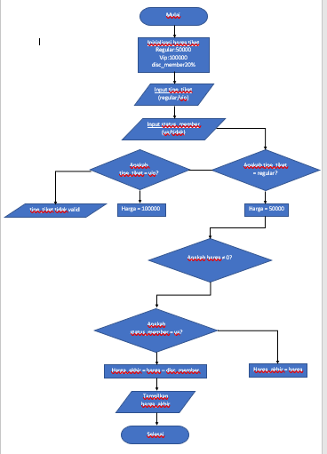

## berikut adalah penjelasan terkait flowchart di atas

mulai:proses dimulai dengan langakah ini, ditandai oleh simbol oval

inisialisasi harga tiket:

Tiket Reguler :Rp50.000

Tiket vip : 100.000

Diskon member:20%

Tentukan harga untuk tiket reguler dan tiket vip,serta diskon yang di berikan untuk member

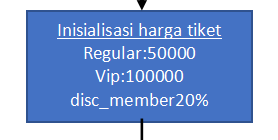

Input Tipe Tiket:Pengguna diminta untuk memasukan tipe tiket yang ingin dibeli, apakah "reguler"atau"vip".

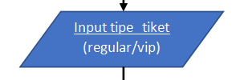

input status member:Pengguna diminta untuk memasukan status keanggotaan mereka apakah memiliki kartu member("ya")atau("tidak")

![gambar]ft7.png

Validasi Tipe Tiket: Program memeriksa apakah tipe tiket yang diinput adalah "reguler" atau "VIP":

Jika tipe tiket adalah "reguler", lanjutkan ke langkah berikutnya dengan harga tiket diatur ke Rp50.000.

Jika tipe tiket adalah "VIP", lanjutkan ke langkah berikutnya dengan harga tiket diatur ke Rp100.000.

Jika tipe tiket bukan "reguler" atau "VIP", anggap sebagai input yang tidak valid dan minta pengguna untuk memasukkan tipe tiket yang benar.

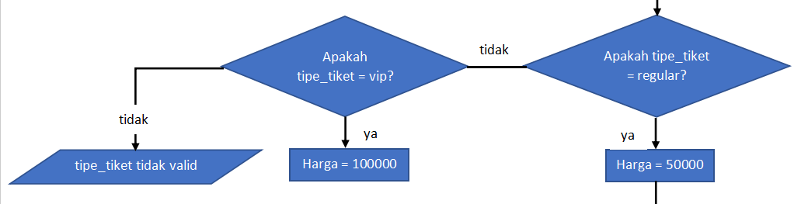

Periksa Apakah Harga Tidak Nol:

Program memeriksa apakah harga tiket sudah diatur (tidak nol):

Jika harga sudah diatur, lanjutkan ke langkah berikutnya.

Jika harga belum diatur (nol), kembali ke input tipe tiket.

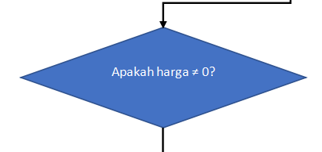

Cek Status Member dan Hitung Diskon:

Program memeriksa apakah pengguna memiliki kartu member:

Jika pengguna memiliki kartu member ("ya"), harga akhir dihitung dengan memberikan diskon 20% (harga * 0.8).

Jika pengguna tidak memiliki kartu member ("tidak"), harga akhir tetap sama dengan harga tiket tanpa diskon.

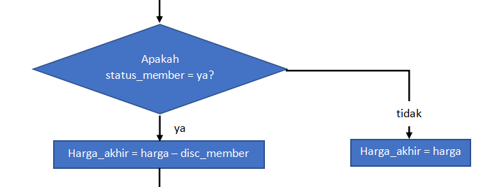

Tampilkan Harga Akhir:

Program menampilkan total harga tiket yang harus dibayar oleh pengguna.

Selesai: Proses selesai, ditandai oleh simbol oval.

##Program python

seperti ini jika algoritma di atas yang di buat dalam bentuk flowchart di jadikan sebuah program dengan bahasa python

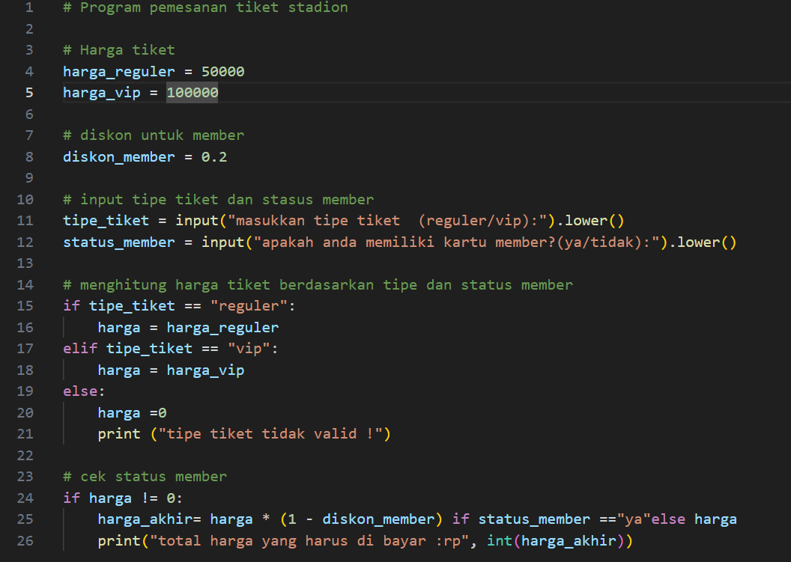

##Hasil eksekusi

ini hasil eksekusi dari kode program di atas

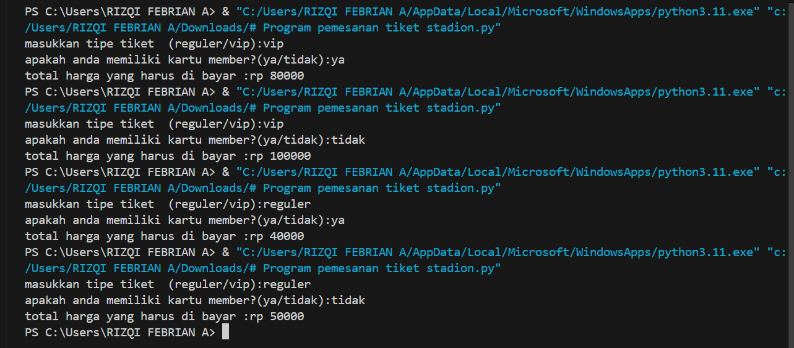

# Membuat program dan flowchart kalkulator sederhana menggunakan if elif else untuk menentukan operasi aritmatika

## flowchart

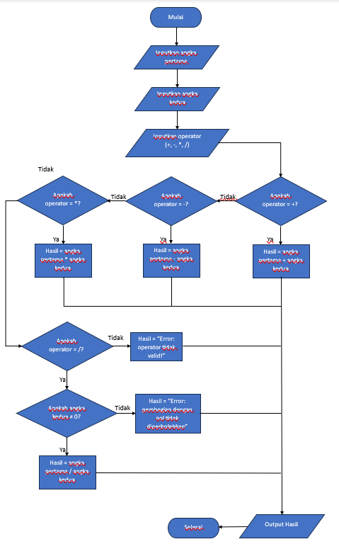

## Berikut adalah penjelasan flowchart di atas

mulai:proses dimulai dengan langakah ini, ditandai oleh simbol oval

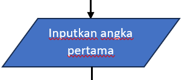

Pengguna diminta menginputkan angka pertama.

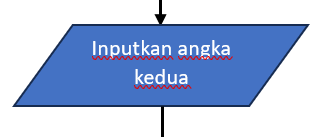

Pengguna diminta untuk menginputkan angka kedua.

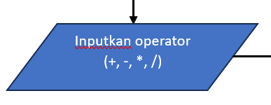

Pengguna diminta untuk menginputkan operator (+, -, *, /).

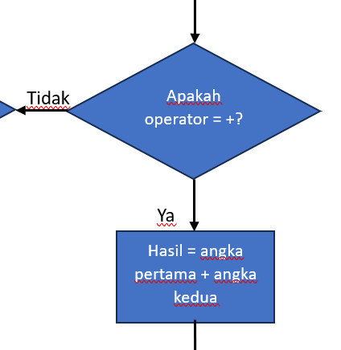

Apakah operator = +?

-Jika Ya, maka Hasil = angka pertama + angka kedua. Dan lanjut ke no10.

-Jika Tidak, maka lanjut ke no6.

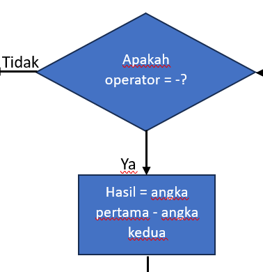

Apakah operator = -?

-Jika Ya, maka Hasil = angka pertama - angka kedua. Dan lanjut ke no10.

-Jika Tidak, maka lanjut ke no7.

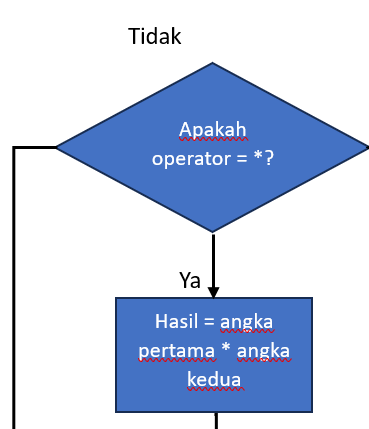

Apakah operator = *?

-Jika Ya, maka Hasil = angka pertama * angka kedua. Dan lanjut ke no10.

-Jika Tidak, maka lanjut ke no8.

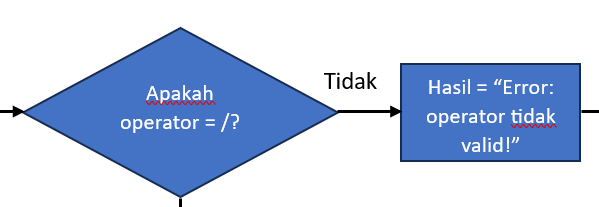

Apakah operator = /?

-Jika Ya, maka lanjut ke no9.

-Jika Tidak, maka Hasil = "Error: operator tidak valid!". Dan lanjut ke no10.

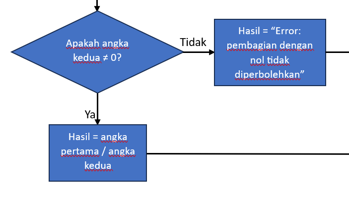

Apakah angka kedua ≠ 0?

-Jika Ya, maka Hasil = angka pertama / angka kedua. Dan lanjut ke no10.

-Jika Tidak, maka Hasil = "Error: pembagian dengan nol tidak diperbolehkan". Dan lanjut ke no10

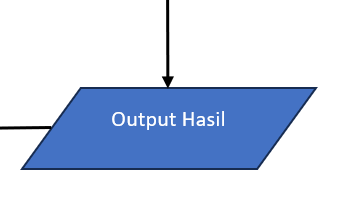

Lalu output atau tampilkan Hasil.

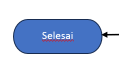

Dan selesai diakhiri menggunakan simbol oval

##Ini adalah program dalam bentuk python:

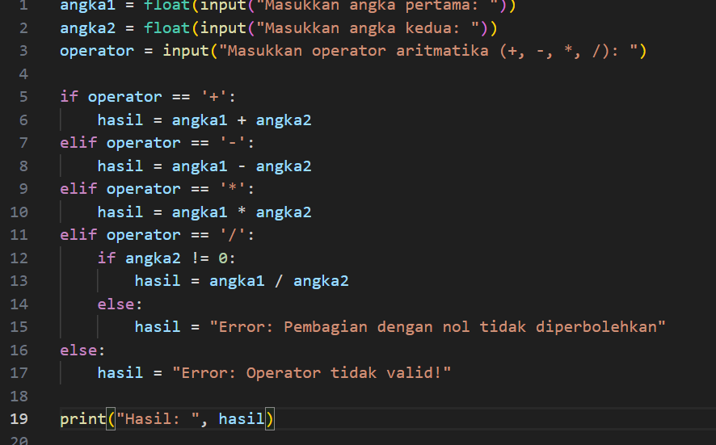

## Hasil dari program di atas